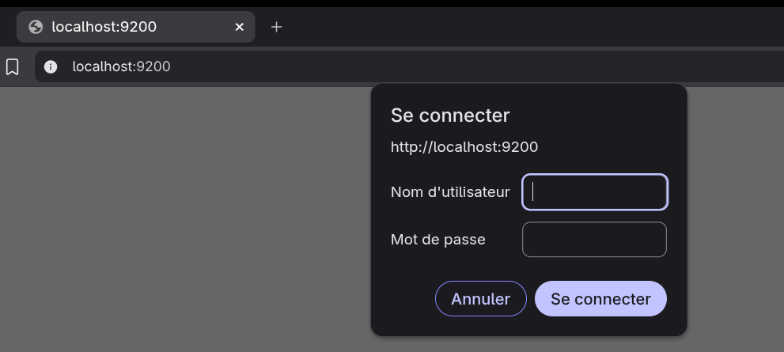
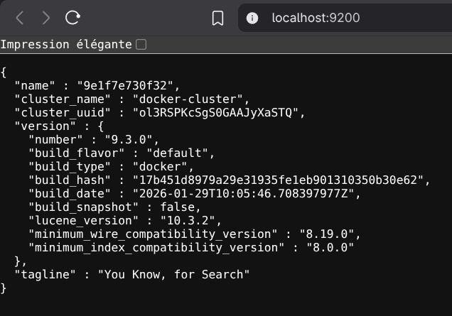
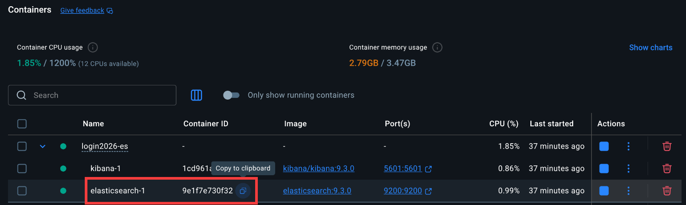
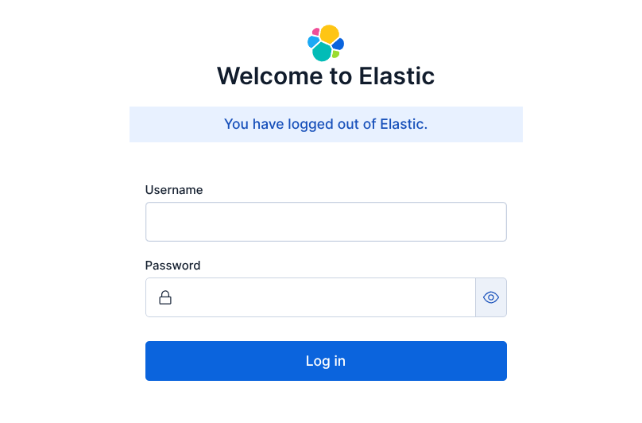
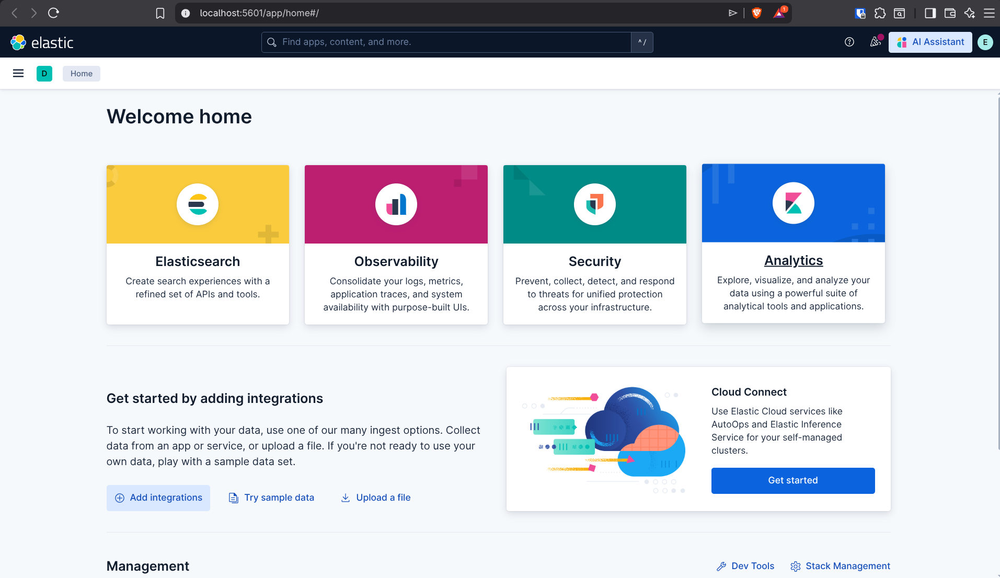

# Elastic search

## Installation
1. Clone this repository : 
2. Open a terminal in the folder.
3. Launch `docker compose up -d`
    - At this point your elastic search server should already be up and running.
    - Verify this by connection to : [http://localhost:9200](http://localhost:9200) (Use the credentials in the Docker compose)
4. When you connect to the website, you'll see this:

5. To connect, use:
    - **elastic** for the username
    - The value of *ELASTIC_PASSWORD* found in the docker-compose.yml file
6. If the connection is right, you should see a message similar to this : 

### Setting up Kibana
Kibana is an interface where you can easily interact with you database, manage the data and visualise it.

1. Go in Docker Desktop and copy the id of your ***elasticsearch*** container.

2. Execute 
``docker exec -it <your_elasticsearch_id> bash ./bin/elasticsearch-reset-password -u kibana_system``
3. Press ***y***
4. Copy the password that has been generated :
5. Replace the value of *elasticsearch.password* in your `kibana.yml` with the password copied.
6. To update the changes, run `docker compose restart`

If you've successfully followed the previous instructions, [http://localhost:5601](http://localhost:5601) should display this.

Use the elastic username and password (used in step I.5)
When everything is set, you will see this page:
